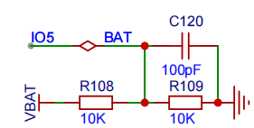
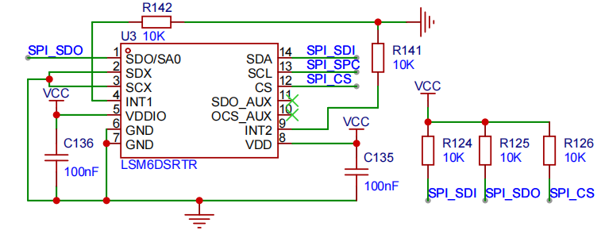
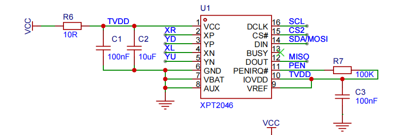

### WS2812

|类型|接口|引脚号|备注|
|---|---|---|---|
|无|DIN|IO48|-|

### 电源电压采集

|类型|接口|引脚号|备注|
|---|---|---|---|
|无|ADC|IO5|-|

电源电压采集设计参考如下：

### Touch

|类型|接口|引脚号|备注|
|---|---|---|---|
|Touch|CH3|IO3|-|
|Touch|CH4|IO4|-|
|Touch|CH6|IO6|-|
|Touch|CH7|IO7|-|

仔细查看 [触摸传感器设计要求](https://docs.espressif.com/projects/esp-hardware-design-guidelines/zh_CN/latest/esp32s3/pcb-layout-design.html#id8)，参考文档进行设计。

### 摇杆

|类型|接口|引脚号|备注|
|---|---|---|---|
|无|X轴|IO1|-|
|无|Y轴|IO2|-|

### 陀螺仪

支持LSM6DS。建议使用I2C用于陀螺仪采集。

|类型|接口|引脚号|备注|
|---|---|---|---|
|SPI|MOSI|IO35|-|
|SPI|MISO|IO37|-|
|SPI|SCL|IO36|-|
|SPI|CS|IO34|-|
|I2C|SDA|IO21|和电容屏一致|
|I2C|SCL|IO20|和电容屏一致|

LSM6DS3设计参考如下：

### 屏幕

支持2.4寸IPS电阻屏和2.8寸IPS电容屏，两款屏幕分辨率都是240*320。

|类型|接口|引脚号|备注|
|---|---|---|---|
|电源管理|POW|IO6|-|
|通用|SCL|IO12|-|
|通用|BLK|IO9|-|
|通用|SDA|IO11|MOSI|
|通用|CS|IO10|-|
|通用|RES|IO14|-|
|通用|DC|IO13|-|
|电阻屏|MISO|IO16|-|
|电阻屏|PEN|IO19|-|
|电阻屏|CS|IO18|-|
|电阻屏|MOSI|IO11|和通用一致|
|电阻屏|SCL|IO12|和通用一致|
|电容屏|INT|IO19|和电阻屏一致|
|电容屏|SDA|IO21|和陀螺仪一致|
|电容屏|SCL|IO20|和陀螺仪一致|

电阻屏的连接需要使用XPT2046，电容屏一般不需要自带驱动芯片。因为不可能同时接两个屏幕，所以中断引脚通用。

XPT2046设计参考如下：

### 麦克风&扬声器

扬声器使用MAX98357，麦克风使用数字麦克风这个随意。

|类型|接口|引脚号|备注|
|---|---|---|---|
|通用|BCLK|40|位时钟|
|通用|LRCK|41|帧时钟/WS|
|扬声器|DATA_OUT|42|数据输出|
|麦克风|DATA_IN|43|数据输入|

### LORA

支持LLCC68芯片模组LORA。

|类型|接口|引脚号|备注|
|---|---|---|---|
|SPI|CS|IO34|-|
|SPI|MOSI|IO35|-|
|SPI|SCL|IO36|-|
|SPI|MISO|IO37|-|
|中断|DIO0|IO38|标记 TX/RX 完成事件|
|中断|DIO1|IO39|接收完成、信号检测|
